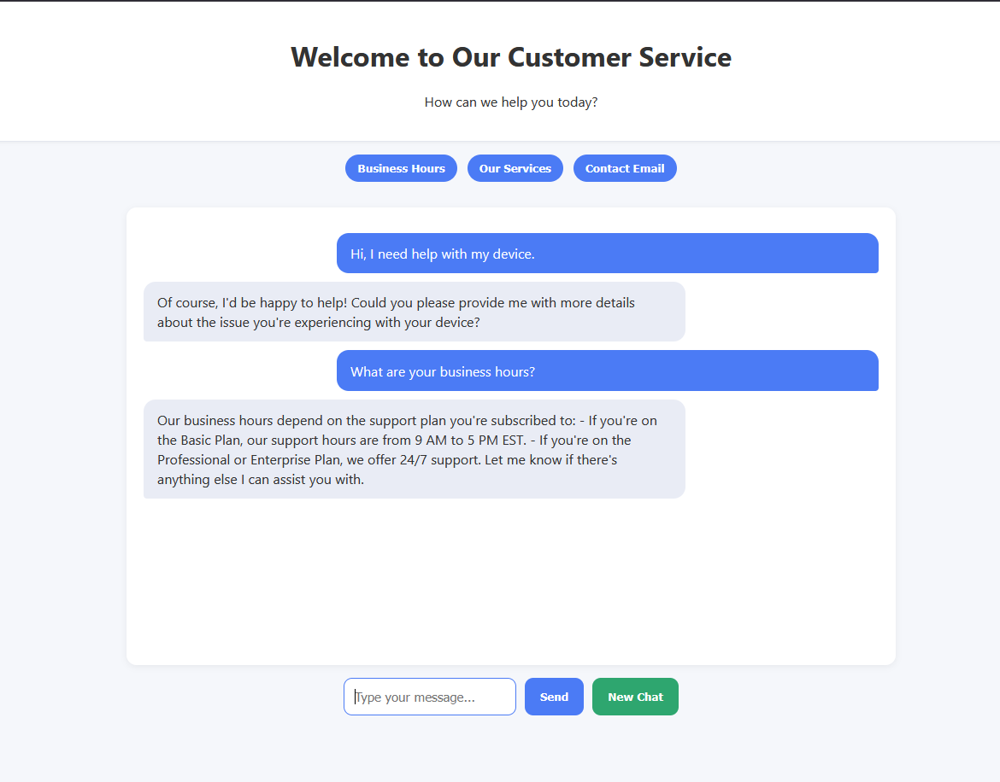

# FastAPI and OpenAI Chatbot

This project demonstrates an interactive chatbot using FastAPI (Python web framework) and OpenAI's API. The chatbot can engage in conversations and provide responses using OpenAI's powerful language models.



## Features

- Interactive web-based chat interface
- Integration with OpenAI's API
- Real-time response generation
- FastAPI backend server
- Simple and clean user interface

## Prerequisites

- Python 3.10 or higher
- pip (Python package installer)
- OpenAI API key

## Project Structure

```
.
├── README.md
├── requirements.txt
└── app/
    ├── main.py           # Main FastAPI application
    ├── static/           # Static files (CSS, JS)
    ├── templates/        # HTML templates
    ├── services/         # Business logic services
    ├── controllers/      # Route controllers
    ├── models/          # Data models
    └── data/            # Data storage
```

The project follows an MVC (Model-View-Controller) architecture pattern:
- Controllers: Handle HTTP requests and responses
- Models: Define data structures
- Services: Contain business logic
- Templates: Store HTML views
- Static: Contains CSS, JavaScript, and other static assets